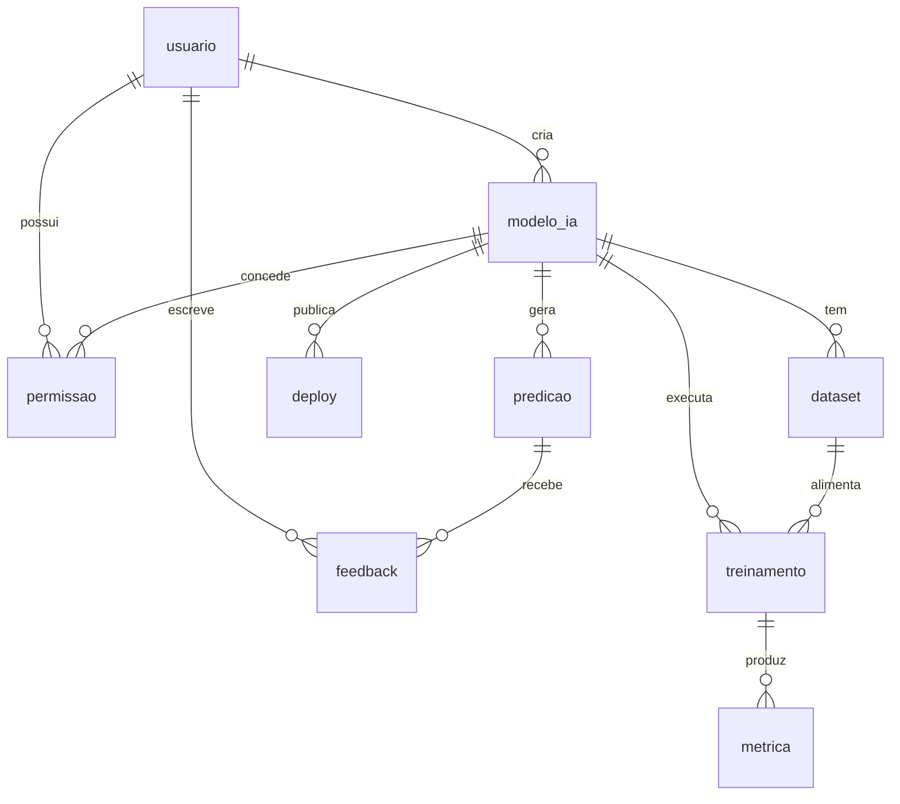

# Oxygeni Hub — Modelagem Física de Banco de Dados (Sprint 4)

Implementação **física** em **PostgreSQL** do modelo lógico do *Oxygeni Hub* — uma
plataforma de gestão de **modelos de Inteligência Artificial** (cadastro de modelos,
datasets, treinamentos, métricas, deploys, predições e feedback dos usuários).

Esta entrega leva o modelo lógico da Sprint 3 para o mundo real, com foco em
**performance** (indexação e análise de planos de execução), **integridade
transacional** (ACID) e **segurança** (controle de acesso com menor privilégio).

---

## 📦 Estrutura do repositório

| Arquivo | Conteúdo |
|---|---|
| [`01_ddl.sql`](01_ddl.sql) | DDL: 9 tabelas, PK/FK, restrições (`NOT NULL`, `UNIQUE`, `CHECK`, `DEFAULT`), tipos do PostgreSQL e **índices**. |
| [`02_dados.sql`](02_dados.sql) | Massa de teste (~225 mil linhas) via `generate_series()` para o `EXPLAIN` ser realista. |
| [`03_transacoes.sql`](03_transacoes.sql) | 2 transações multi-tabela com `BEGIN`/`COMMIT`/`ROLLBACK`/`SAVEPOINT`/`RETURNING`. |
| [`04_explain.sql`](04_explain.sql) | `EXPLAIN (ANALYZE, BUFFERS)` de 2 consultas, com comparação antes/depois do índice. |
| [`05_seguranca.sql`](05_seguranca.sql) | 2 *roles* de grupo + 2 usuários, `GRANT`/`REVOKE` e testes de fronteira. |

### Como executar

Os scripts são **numerados e idempotentes** — rodam na ordem, do zero, quantas vezes quiser.

```bash
# 1. cria o banco dedicado
createdb oxygeni_hub                 # ou: psql -c "CREATE DATABASE oxygeni_hub;"

# 2. estrutura + dados + análise (podem usar ON_ERROR_STOP)
psql -d oxygeni_hub -f 01_ddl.sql
psql -d oxygeni_hub -f 02_dados.sql
psql -d oxygeni_hub -f 04_explain.sql

# 3. transações e segurança contêm erros PROPOSITAIS (SAVEPOINT/ROLLBACK e acessos
#    negados), então rode SEM ON_ERROR_STOP para ver a demonstração completa:
psql -d oxygeni_hub -f 03_transacoes.sql
psql -d oxygeni_hub -f 05_seguranca.sql
```

---

## 🗺️ Modelo físico



`usuario` → `modelo_ia` → (`dataset`, `treinamento` → `metrica`, `deploy`, `predicao` → `feedback`), com `permissao` ligando usuário↔modelo.

---

## 🔤 Justificativa dos tipos de dados

A regra foi escolher o **menor tipo que representa o dado com segurança**, usando
recursos nativos do PostgreSQL em vez de `VARCHAR`/`TIMESTAMP` genéricos.

| Coluna(s) | Tipo escolhido | Por quê |
|---|---|---|
| `id_*` de tabelas comuns | `SERIAL` (int 4 bytes) | Auto-incremento; 2 bilhões de valores bastam. |
| `predicao.id_predicao`, `feedback.id_feedback` | `BIGSERIAL` (int 8 bytes) | Tabelas de **alto volume** — predições/feedbacks crescem rápido e um `int` estouraria. |
| `email` | `VARCHAR(255)` | Limite prático de e-mail; combinado com `UNIQUE` + `CHECK` de formato. |
| `descricao`, `entrada`, `resultado` | `TEXT` | Conteúdo livre e potencialmente grande; `TEXT` não tem custo extra vs. `VARCHAR` no PG. |
| `tamanho_mb` | `NUMERIC(12,2)` | Valor decimal **exato** (nada de erro de ponto flutuante em tamanho/medida). |
| `metrica.valor` | `NUMERIC(10,4)` | Métricas (acurácia, F1…) precisam de 4 casas exatas. |
| `nota` | `SMALLINT` | Faixa 1–5 cabe em 2 bytes; `CHECK` garante o intervalo. |
| Datas/horas (`criado_em`, `data_hora`, `data_inicio`…) | `TIMESTAMPTZ` | **Com fuso horário** — evita ambiguidade e é a recomendação oficial do PostgreSQL. |
| `status`, `tipo`, `ambiente` | `VARCHAR(n)` + `CHECK` | Domínio fechado controlado por `CHECK` (mais simples que uma tabela de apoio, mais seguro que texto livre). |

### Restrições (integridade)

- **`PRIMARY KEY`** em todas as tabelas; **`FOREIGN KEY`** com `ON DELETE` explícito:
  `CASCADE` quando o filho não existe sem o pai (ex.: `dataset` sem `modelo_ia`) e
  `RESTRICT` para proteger dados referenciados (ex.: não apagar `usuario` com modelos).
- **`NOT NULL`** em toda coluna obrigatória.
- **`UNIQUE`**: `usuario.email` e `permissao(id_usuario, id_modelo, tipo)` (evita permissão duplicada).
- **`CHECK`**: formato de e-mail, `tamanho_mb > 0`, `metrica.valor >= 0`,
  `feedback.nota BETWEEN 1 AND 5`, `treinamento.data_fim >= data_inicio` e os domínios de `status`/`tipo`/`ambiente`.
- **`DEFAULT`**: `now()` nas colunas de auditoria e `'pendente'`/`'ativo'` nos status.

---

## 📊 Estratégia de indexação

> **Princípio:** não indexar tudo. Todo índice acelera leitura mas **penaliza
> escrita** (`INSERT`/`UPDATE`/`DELETE`) e ocupa espaço. O PostgreSQL **já cria
> índice automático** para toda `PRIMARY KEY` e `UNIQUE`, então criamos índices
> manuais só onde há ganho comprovado.

**O que foi indexado e por quê:**

1. **Chaves estrangeiras usadas em `JOIN`** (`idx_modelo_usuario`, `idx_dataset_modelo`,
   `idx_treino_modelo`, `idx_treino_dataset`, `idx_metrica_treino`, `idx_deploy_modelo`,
   `idx_predicao_modelo`, `idx_feedback_predicao`, `idx_feedback_usuario`,
   `idx_permissao_modelo`). O PostgreSQL **não** cria índice de FK automaticamente;
   sem eles, cada `JOIN` vira `Seq Scan` na tabela filha.
2. **`idx_predicao_data_hora` (`data_hora DESC`)** — consultas de dashboard do tipo
   "predições recentes" filtram por período e ordenam por data. O `DESC` no índice
   espelha o `ORDER BY ... DESC` e serve o `WHERE` e a ordenação de uma só vez.
3. **`idx_deploy_ambiente_status` (composto)** — relatório "deploys de um ambiente
   com um status". A ordem `(ambiente, status)` atende tanto o filtro só por `ambiente`
   quanto por ambos.
4. **`idx_deploy_producao_ativo` (parcial)** — as consultas operacionais só olham o que
   está no ar. Indexar apenas `WHERE ambiente='producao' AND status='ativo'` deixa o
   índice minúsculo e rápido.

**O que deliberadamente *não* foi indexado:** colunas de baixa cardinalidade isoladas
(ex.: `treinamento.status` sozinho), `TEXT` livres (`descricao`, `entrada`) e colunas
raramente filtradas — indexá-las só tornaria a escrita mais lenta sem retorno.

---

## 🔄 Transações ([`03_transacoes.sql`](03_transacoes.sql))

O `RETURNING` captura o ID recém-gerado (`SERIAL`/`BIGSERIAL`); no `psql` o `\gset`
guarda esse valor numa variável reutilizada nos `INSERT`s filhos da **mesma** transação.

### Transação 1 — Onboarding de modelo (`SAVEPOINT` + `RETURNING`)
Insere `usuario` → `modelo_ia` → `dataset` → `treinamento` → `metrica` de forma atômica.
Um `SAVEPOINT` é criado antes de inserir o dataset; um valor inválido (`tamanho_mb < 0`)
viola o `CHECK`, e o **`ROLLBACK TO SAVEPOINT`** descarta **apenas** esse erro,
preservando o usuário e o modelo já inseridos. Depois corrige e faz **`COMMIT`**.

### Transação 2 — Predição + feedback (`ROLLBACK` total)
Insere uma `predicao` e tenta um `feedback` com `nota = 9` (viola `CHECK 1..5`). Como o
erro compromete a operação inteira, um **`ROLLBACK`** desfaz **tudo** — inclusive a
predição provisória. Em seguida a versão correta é gravada com `COMMIT`.

**Prova de atomicidade** (saída real): a predição de teste aparece **exatamente 1 vez**,
confirmando que a versão do `ROLLBACK` não persistiu:

```
 predicoes_pix_persistidas
---------------------------
                         1
```

> 💡 Observação: os IDs consumidos pela tentativa que sofreu `ROLLBACK` **não** são
> reaproveitados (sequences não retrocedem). Isso é o comportamento correto do
> PostgreSQL e não fere a atomicidade dos **dados**.

---

## 🔎 Análise com EXPLAIN ANALYZE ([`04_explain.sql`](04_explain.sql))

Rodado sobre **200.000 predições**, com `EXPLAIN (ANALYZE, BUFFERS)`.

### Consulta 1 — JOIN de 3 tabelas usando índices de FK
`metrica ⨝ treinamento ⨝ modelo_ia`, filtrando `status='concluido'` e `id_usuario=7`.

```
 Nested Loop  (actual time=0.429..1.203 rows=21 loops=1)
   ->  Hash Join  (t.id_modelo = mo.id_modelo)   -- Seq Scan em treinamento(1000) e modelo_ia(200)
   ->  Index Scan using idx_metrica_treino on metrica m   -- índice de FK usado
         Index Cond: (id_treinamento = t.id_treinamento)
 Execution Time: 1.400 ms
```

**Leitura:** o índice `idx_metrica_treino` **é usado** para buscar as métricas de cada
treinamento (a tabela maior no caminho). Nas tabelas pequenas (`treinamento`,
`modelo_ia`) o planejador escolhe `Seq Scan` **de propósito** — varrer 200–1000 linhas
é mais barato que usar índice. Isso mostra que o otimizador está tomando a decisão certa.

### Consulta 2 — Filtro por período + `ORDER BY` (antes × depois do índice)
"Últimas 100 predições dos últimos 7 dias" — o cenário que justifica `idx_predicao_data_hora`.

**ANTES (sem índice):** varredura completa + ordenação.
```
 Limit  (actual time=72.843..78.692 rows=100)
   ->  Gather Merge (Workers Launched: 1)
         ->  Sort  (Sort Key: data_hora DESC, top-N heapsort)
               ->  Parallel Seq Scan on predicao
                     Filter: (data_hora >= now() - '7 days')
                     Rows Removed by Filter: 98084
                     Buffers: shared hit=2470
 Execution Time: 79.594 ms
```

**DEPOIS (com `idx_predicao_data_hora`):** o índice atende `WHERE` e `ORDER BY` juntos.
```
 Limit  (actual time=0.018..0.113 rows=100)
   ->  Index Scan using idx_predicao_data_hora on predicao
         Index Cond: (data_hora >= now() - '7 days')
         Buffers: shared hit=103
 Execution Time: 0.131 ms
```

| Métrica | Sem índice | Com índice | Ganho |
|---|---|---|---|
| Tempo de execução | **79,59 ms** | **0,13 ms** | **~600×** |
| Buffers lidos | 2.470 | 103 | ~24× menos I/O |
| Operação | `Parallel Seq Scan` + `Sort` | `Index Scan` | sem varredura, sem ordenar |

O `Seq Scan` sumiu e não há mais etapa de `Sort` (o índice já entrega os dados ordenados),
confirmando que o índice é usado e resolve o gargalo.

---

## 🔐 Controle de acesso ([`05_seguranca.sql`](05_seguranca.sql))

Modelo baseado em **menor privilégio** e em ***roles* de grupo** (cargos), não em
permissões soltas por usuário.

| Papel | Tipo | Permissões |
|---|---|---|
| `oxygeni_leitura` | `ROLE` grupo (`NOLOGIN`) | `USAGE` no schema + `SELECT` em todas as tabelas **exceto `feedback`**. |
| `oxygeni_app` | `ROLE` grupo (`NOLOGIN`) | CRUD (`SELECT/INSERT/UPDATE/DELETE`) **sem `DELETE` em `predicao`**; sem DDL. |
| `analista_bi` | **usuário** (`LOGIN`) | Herda `oxygeni_leitura` → só leitura. |
| `app_backend` | **usuário** (`LOGIN`) | Herda `oxygeni_app` → CRUD controlado. |

**Decisões de segurança:**
- `REVOKE ALL ON SCHEMA oxygeni FROM PUBLIC` — remove o acesso implícito de qualquer role.
- `REVOKE SELECT ON feedback FROM oxygeni_leitura` — feedback é dado **sensível** de usuário; BI não precisa dele.
- `REVOKE DELETE ON predicao FROM oxygeni_app` — histórico de predições é **auditoria**; a aplicação insere e consulta, mas não apaga.

**Testes de fronteira (saída real, via `SET ROLE`):**

```
# analista_bi
SELECT count(*) FROM usuario;     -> 51          (OK)
SELECT count(*) FROM feedback;    -> ERRO: permissão negada para tabela feedback
INSERT INTO usuario ...           -> ERRO: permissão negada para tabela usuario

# app_backend
INSERT INTO usuario ...           -> id_usuario 52   (OK, desfeito com ROLLBACK)
DELETE FROM predicao ...          -> ERRO: permissão negada para tabela predicao
```

Matriz de privilégios resultante nas tabelas sensíveis:

```
     grantee     | table_name | privilege_type
-----------------+------------+----------------
 oxygeni_app     | predicao   | INSERT, SELECT, UPDATE      (sem DELETE)
 oxygeni_leitura | predicao   | SELECT
 oxygeni_app     | feedback   | SELECT, INSERT, UPDATE, DELETE
                 | feedback   | (oxygeni_leitura ausente -> SELECT revogado)
```

> As senhas nos scripts são exemplos didáticos — troque-as em uso real.

---

## ✅ Checklist da entrega

- [x] DDL com PK, FK e restrições (`NOT NULL`, `UNIQUE`, `CHECK`, `DEFAULT`) e tipos do PostgreSQL
- [x] Índices com justificativa (FKs, `WHERE`/`ORDER BY`, composto e parcial)
- [x] 2 transações multi-tabela com `BEGIN`/`COMMIT`/`ROLLBACK`/`SAVEPOINT` e `RETURNING`
- [x] `EXPLAIN ANALYZE` em 2 consultas, comprovando uso de índice (antes × depois)
- [x] 2 usuários + 1 role (na verdade 2 roles de grupo) com `GRANT`/`REVOKE` e menor privilégio
- [x] Documentação (este README)

**Ambiente:** PostgreSQL 17 · banco `oxygeni_hub`.
